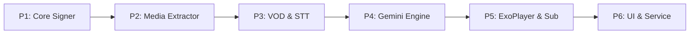

# KẾ HOẠCH TOÀN DIỆN PORT TOOL CAPCUT TTS/STT SANG ANDROID APP (CapSub AI Studio)

Tài liệu này quy định chi tiết kiến trúc, luồng dữ liệu, công nghệ và các giai đoạn triển khai ứng dụng Android độc lập (100% Client-side, không cần Server trung gian) với các chức năng:
1. Nhận Video/Audio bất kỳ từ thiết bị.
2. Trích xuất âm thanh siêu tốc và nhận diện phụ đề STT qua API CapCut Cloud.
3. Dịch phụ đề theo ngữ cảnh qua Google Gemini API.
4. Phát Video với phụ đề mềm hiển thị trực tiếp (VLC Style, không hardcode/burn-in), hỗ trợ Hộp Đen (BlackBox) che phụ đề gốc.

---

## I. KIẾN TRÚC TỔNG THỂ & TECH STACK

### 1. Công nghệ đề xuất (Native Android)
* **Ngôn ngữ:** Kotlin 2.0+
* **Giao diện (UI):** Jetpack Compose + Material Design 3
* **Trình phát Video & Phụ đề:** AndroidX Media3 (ExoPlayer 1.4+)
* **Xử lý Audio/Video:** Android Native `MediaExtractor` + `MediaMuxer` (Demux siêu tốc, 0 MB phụ thuộc ngoài)
* **Mạng (Networking):** OkHttp 4.12+ (Connection Pool, Streaming Chunks, Retry) + Kotlinx Serialization JSON
* **Đa luồng & Bất đồng bộ:** Kotlin Coroutines + StateFlow + ViewModel
* **Tiến trình chạy ngầm:** Android `ForegroundService` + Notification (chống tắt app khi khóa màn hình)
* **Lưu trữ cục bộ:** Jetpack DataStore Preferences (lưu API Key, cấu hình)

### 2. Cấu trúc thư mục mã nguồn Android dự kiến
```
app/src/main/java/com/capcut/capsub/
├── CapSubApplication.kt
├── data/
│   ├── api/
│   │   ├── CapCutSigner.kt          # Port từ signer.py (MD5, SHA256, AWS SigV4)
│   │   ├── CapCutVodUploader.kt     # Port từ uploader.py (VOD 5MB chunks, CRC32)
│   │   ├── CapCutSttClient.kt       # Port từ client.py (common_task/new & query)
│   │   └── GeminiTranslator.kt      # Port từ translator.py (Gemini REST, Smart Chunking)
│   ├── model/
│   │   ├── DeviceConfig.kt          # Giả lập thiết bị Mac/PC
│   │   ├── SubtitleItem.kt          # Model câu phụ đề (startMs, endMs, text)
│   │   ├── SubtitleDocument.kt      # Toàn bộ danh sách phụ đề + Parser/Exporter SRT
│   │   └── ProcessProgress.kt       # Model tiến trình 4 giai đoạn
│   └── repository/
│       └── SettingsRepository.kt    # Quản lý Gemini API Key, cấu hình dịch
├── domain/
│   ├── media/
│   │   ├── AudioExtractor.kt        # Tách M4A từ MP4 qua MediaExtractor/MediaMuxer
│   │   └── AudioChunker.kt          # Cắt lát âm thanh 10 phút nếu file dài
│   └── service/
│       └── TranscribeWorkerService.kt # ForegroundService điều phối pipeline
├── player/
│   ├── PlayerManager.kt             # Điều khiển ExoPlayer
│   └── SubtitleSynchronizer.kt      # Đồng bộ mốc thời gian phụ đề và BlackBox overlay
└── ui/
    ├── home/
    │   ├── HomeScreen.kt            # Màn hình chọn file & cấu hình
    │   └── ProgressBottomSheet.kt   # Modal tiến trình thời gian thực 4 bước
    ├── player/
    │   ├── VideoPlayerScreen.kt     # Màn hình xem video toàn màn hình
    │   ├── SubtitleOverlay.kt       # Lớp phụ đề nổi + Hộp đen che sub cứng
    │   └── TranscriptSheet.kt       # Danh sách kịch bản cuộn theo video
    ├── settings/
    │   └── SettingsScreen.kt        # Màn hình cài đặt API Key & luồng
    └── theme/
        ├── Color.kt                 # Bảng màu Dark Mode cao cấp
        └── Theme.kt
```

---

## II. CHI TIẾT 6 GIAI ĐOẠN TRIỂN KHAI (PHASES)



### GIAI ĐOẠN 1: Module Mạng & Ký Chữ Ký (Porting `signer.py`)
* **Mục tiêu:** Tạo chữ ký CapCut và AWS SigV4 bằng thư viện bảo mật native của Java/Android (`java.security.MessageDigest`, `javax.crypto.Mac`).
* **Các thành phần chính:**
  1. `makeSignHeader(url, appvr, deviceTime, tdid)`: Băm chuỗi `9e2c|{path[-7:]}|3|{appvr}|{device_time}|{tdid}|11ac` sang MD5.
  2. `makeSsStub(bodyText)`: Băm MD5 của chuỗi JSON body.
  3. `aws4Authorization(...)`: Tạo chữ ký AWS SigV4 HMAC-SHA256 theo chuẩn VOD ByteDance.
  4. `DeviceConfig`: Giả lập thiết bị Mac/PC (`aid: 359289`, `channel: capcutpc_google`, `pf: 3`, ngẫu nhiên `device_id`/`tdid` 19 chữ số).
* **Tiêu chuẩn kiểm thử:** Chạy Unit Test so sánh đầu ra chữ ký của Kotlin và Python với cùng input, đảm bảo khớp 100%.

---

### GIAI ĐOẠN 2: Bộ Xử Lý Tách & Cắt Âm Thanh Siêu Tốc (`AudioExtractor`)
* **Mục tiêu:** Nhận video bất kỳ (lên đến 4K, dung lượng 1-5GB) và trích xuất thành âm thanh `.m4a` chỉ trong 1-2 giây mà không hao pin, không tràn RAM.
* **Các thành phần chính:**
  1. `AudioExtractor.extractToM4a(videoUri, outFile)`: Sử dụng `MediaExtractor` đọc trực tiếp track audio và `MediaMuxer` đóng gói thành `.m4a` (Direct Stream Copy, không re-encode).
  2. `AudioChunker.splitIntoChunks(audioFile, chunkSec = 600)`: Nếu thời lượng video > 10 phút, tự động cắt thành các lát 10 phút để tránh lỗi timeout của CapCut.
  3. Quản lý dọn rác bộ nhớ cache (`context.cacheDir.deleteOnExit()`).

---

### GIAI ĐOẠN 3: Động Cơ Upload VOD & STT CapCut (Porting `uploader.py` & `client.py`)
* **Mục tiêu:** Gửi âm thanh lên CapCut Cloud và nhận về danh sách phụ đề có mốc thời gian.
* **Các thành phần chính:**
  1. `CapCutVodUploader`:
     - Gọi POST `/lv/v1/upload_sign` lấy AWS STS token.
     - Ký AWS SigV4 gọi `ApplyUploadInner`.
     - Upload streaming từng chunk 5MB kèm mã CRC32 nhị phân.
     - Gọi `CommitUploadInner` lấy `vid` và `md5`.
  2. `CapCutSttClient`:
     - Gửi POST `/lv/v1/common_task/new` với `req_key: cc_audio_subtitle_asr`.
     - Vòng lặp Polling `/lv/v1/common_task/query` mỗi 2 giây.
     - Phân tích JSON `payload.utterances` thành danh sách `SubtitleItem(id, startMs, endMs, originalText)`.
     - Khâu khâu ghép timeline (Stitching): Nếu có nhiều chunk 10 phút, cộng dồn offset mili-giây để timeline không bị lệch.

---

### GIAI ĐOẠN 4: Động Cơ Dịch Thuật Gemini AI (Porting `translator.py`)
* **Mục tiêu:** Dịch tự động từ tiếng Trung/Anh sang tiếng Việt, giữ nguyên 100% timecode và sắc thái nhân vật.
* **Các thành phần chính:**
  1. `GeminiClient`: Gọi REST API `https://generativelanguage.googleapis.com/v1beta/models/{model}:generateContent?key={key}`.
  2. Multi-Key Pool: Hỗ trợ nạp danh sách nhiều API Key, tự động đổi key khác ngay khi gặp lỗi 429 (Hết hạn mức) hoặc 403.
  3. Smart Chunking: Gom 40 - 60 câu phụ đề mỗi request để dịch đúng ngữ cảnh, không rớt câu.
  4. Presets phong cách:
     - 🎬 *Phim ngắn Zhihu (Kịch tính, vả mặt, dồn dập)*
     - 📖 *Thuần Việt văn học (Mượt mà, thoát ý)*
     - ⚔️ *Cổ trang tiên hiệp (Bảo lưu danh xưng Hán Việt)*
     - ✨ *Tự động nhận diện ngữ cảnh AI*
  5. Xuất và Lưu file: Chuyển đổi danh sách phụ đề sang định dạng `.srt` lưu vào bộ nhớ máy.

---

### GIAI ĐOẠN 5: Trình Xem Video & Hiển Thị Phụ Đề Nổi (VLC-Style Player)
* **Mục tiêu:** Phát video mượt mà, đồng bộ phụ đề chính xác đến từng mili-giây, hỗ trợ che phụ đề cứng.
* **Các thành phần chính:**
  1. Tích hợp **AndroidX Media3 ExoPlayer** phát video mượt mà với phần cứng (Hardware Acceleration).
  2. **Soft Subtitle Overlay (Lớp phụ đề mềm):** Hiển thị chữ tiếng Việt đè lên video mà không cần render/burn-in lại video.
  3. **Tính năng Hộp Đen (BlackBox Covering):**
     - Tạo một khung chữ nhật đen mờ (`#D9000000`) che đúng vị trí phụ đề tiếng Trung cứng có sẵn của video.
     - Cho phép người dùng vuốt kéo thả để điều chỉnh độ cao/vị trí hộp đen.
  4. Cử chỉ vuốt chuẩn VLC: Vuốt bên trái tăng giảm độ sáng, vuốt bên phải tăng giảm âm lượng, vuốt ngang để tua.
  5. Chuyển đổi 3 chế độ: *Chỉ Tiếng Việt* | *Song Ngữ (Trung trên - Việt dưới)* | *Tắt Phụ Đề*.
  6. Tab Kịch bản (Transcript): Hiển thị danh sách câu thoại dưới player, câu đang phát sáng lên và tự cuộn, bấm vào câu nào tua tới câu đó.

---

### GIAI ĐOẠN 6: Giao Diện Người Dùng & Quản Lý Tiến Trình (UI & Service)
* **Mục tiêu:** Giao diện Dark Theme hiện đại, đơn giản hóa tối đa quy trình cho người dùng.
* **Các thành phần chính:**
  1. `HomeScreen`:
     - Chọn file Video/Audio qua Storage Access Framework.
     - Card xem trước thông tin file (Tên, thời lượng, dung lượng).
     - Bộ chọn ngôn ngữ gốc & Phong cách dịch.
  2. `ProgressBottomSheet`:
     - Hiển thị tiến trình trực quan qua 4 bước: (1) Tách âm thanh -> (2) Upload VOD -> (3) Nhận diện STT -> (4) Gemini Dịch thuật.
     - Nút Hủy tác vụ an toàn.
  3. `TranscribeWorkerService` (ForegroundService):
     - Chạy ngầm toàn bộ pipeline kèm Notification hiển thị tiến trình % để hệ điều hành Android không kill ứng dụng khi tắt màn hình.
  4. `SettingsScreen`:
     - Quản lý API Key Gemini, cấu hình số luồng (2-3 luồng).

---

## III. CHIẾN LƯỢC TỐI ƯU HIỆU NĂNG & AN TOÀN TRÊN ANDROID

1. **Bộ nhớ RAM (Chống OOM):**
   - Đọc và upload theo luồng trực tiếp (Streaming 5MB Chunk).
   - Tách audio bằng `MediaExtractor` (buffer 256KB).
   - Tổng mức tiêu thụ RAM luôn duy trì dưới **45MB** cho mọi kích thước file.
2. **Tiết kiệm Pin & Không nóng máy:**
   - 100% không render lại video (tiết kiệm hàng chục phút render và hàng GB dung lượng trống).
3. **Chống đơ giao diện (ANR):**
   - 100% logic mạng, đọc ghi file chạy trên `Dispatchers.IO`. UI chỉ quan sát qua `StateFlow`.
4. **Offline Ready cho Player:**
   - Phụ đề sau khi dịch xong được lưu thành file `.srt` cục bộ ngay cạnh video, người dùng có thể mở xem lại bất cứ lúc nào không cần mạng.

---

## IV. LỘ TRÌNH THỰC HIỆN CỤ THỂ
* **Bước 1:** Khởi tạo khung dự án Android Studio (Gradle, Dependencies, Permissions, Architecture).
* **Bước 2:** Viết các Unit Test và cài đặt module `CapCutSigner` + `DeviceConfig`.
* **Bước 3:** Cài đặt module `AudioExtractor` (Tách âm thanh không re-encode).
* **Bước 4:** Cài đặt module `CapCutVodUploader` và `CapCutSttClient`.
* **Bước 5:** Cài đặt module `GeminiTranslator` với Smart Chunking và Multi-Key failover.
* **Bước 6:** Xây dựng `TranscribeWorkerService` liên kết toàn bộ pipeline.
* **Bước 7:** Xây dựng `VideoPlayerScreen` với Media3 ExoPlayer và Subtitle BlackBox Overlay.
* **Bước 8:** Hoàn thiện UI Home, BottomSheet tiến trình, Cài đặt và kiểm thử toàn diện trên thiết bị thật.
